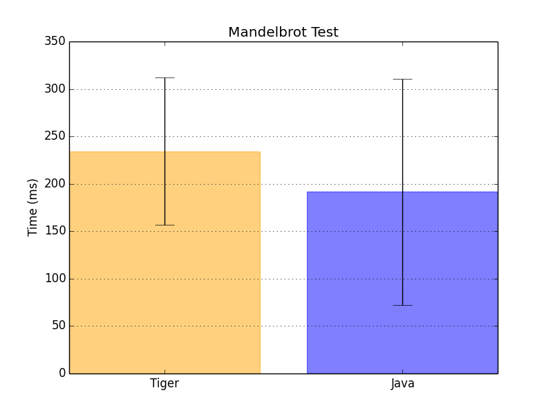

# Mini Tiger with GraalVm and Truffle proof-of-concept #


## Tiger language modification ##
I have modified the official Tiger <a href="https://cs.nyu.edu/courses/fall13/CSCI-GA.2130-001/tiger-spec.pdf">specification</a> to simplify the development time because this is a proof-of-concept

The principal modifications are:
-  This implementation does not have **Record** types, then, there are not  **Record** fields or **Record** field access

-  There is double type support **(\d+\\.\d+)**

- There are only three builtin functions:
    - **print** (print the String representation of the first argument), ie: 
        ``` 
        print(19)
        > 19
        ```
        
        ``` 
         print("hello world")
         > hello world
        ```
        
        ``` 
        print(nano_time())
        > ... 
        ```
    
    - **nano_time** (returns the **System.nanoTime()** Java function result)
    - **wait** (Sleep the current thread by **x** milliseconds where **x** is the first argument)
    
- There is no type declaration or check. All types and values are created and assigns dynamically

- There is no comment declarations

## Graal VM and Truffle

I use the <a href="http://www.oracle.com/technetwork/oracle-labs/program-languages/downloads/index.html">official</a> graal jdk compilation with Truffle (*com.oracle.truffle:1.0.0-rc1*) and then I transform the Antlr output AST to Truffle api AST basically

### Types
These are the types mapped to Truffle api definition:
   - Long
   - Double
   - Function (This is a custom function object implementation)
   - Nil (Every expression in Mini-Tiger returns value, so, nil is the default)


### Variable Scope

The variables and functions scope are implemented like tree parent contexts. Every scope has a parent scope. If a variable does not exist in the current scope, then, it is searched in the parent scope until the variable is found or there is no parent and throw a *The variable x is not defined* exception.

```
    
    | a. 1 |
    | b, "hello world" | <-
     ...                   |
     ...                 | a, 10  |
     ...                 | z, 1000|
     
    |c, 1 |
     
```

### Performance

In dynamic languages, the concrete operation behind the multiplication ‘*’, the division ‘/’ or a less-than ‘<’ comparison operator is typically known only at runtime.
 
For optimal performance a language implementation needs to ensure that  these operators are not looked up for every single operation. 

My first approach to the variable (read, write) and function lookups shows that there is a huge overload in did ... almost 10X time of the final time execution result. 

### Variable lookup

All the variable and function arguments are stored in **FrameSlots** (this is the Truffle api implementation for value storages). I ensure that every variable access (read and write) address is stored in her specific AST Node to avoid walking through the Scope tree structure in every read-write call. The variable context structures are built in the AST construction stage and written in the node as a O(1) access java field.

The truffle api options to read and write values bring a way to avoid the boxing and unboxing of those values. However, the only way to pass arguments to a function call (Mapping to Graal RootNode class) is passing the values as Object values.

So, I ensure that exist only a few unboxing operations. The only unboxing operations are present in the ReadArg node evaluation in the AST.

### Operation Lookups


### Function calls

Truffe can set the function call arguments in a api class named Frame, that is optimized in the graal vm execution.

In Tiger we have nested functions args scopes, for this reason, I added an extra argument in the Frame object passed to a function call.

To pass arguments to a function call I set the arguments as follows :
   - The first argument is the current execution branch Frame
   - The next arguments are the evaluated expressions for the current Tiger function call
    
        ```
            function a(n)=
                let
                    function b(r)=
                        print(r + n) // to access the n value we have to access the first argument in the b call and then the frame argument of the a scope
                in
                    b(n)
                end
        ```
        
        
    

### Tests

I test the <a href="https://github.com/smarr/Classic-Benchmarks/blob/master/benchmarks/Mandelbrot.java#L42ß">classic Mandelbrot benchmark</a> for Java and <a href="https://gitlab.com/Jacarte9212/tiger-graal/blob/master/tiger-compiler/src/tests/mandelbrot.tiger">a custom tiger Mandelbrot test<a>

### Tests Results and remarks



The results are very encouraging. The deviation between the mean, the max and min execution time values is because Graal vm ensure inline function calls and cache the most cacheable nodes (Integer constants, etc), so the first calls have remarkable delays, but this is a java run effect too as we can see in the figure above.


## Future research
- Tail call optimization:

    In related works <a href="http://cesquivias.github.io/blog/2015/01/15/writing-a-language-in-truffle-part-4-adding-features-the-truffle-way/">[1]</a> the author propose to implement a Tail Call optimization showing very good results for recursive function calls
- IGV profiling to detect operations time overloads and unexpected nodes construction

    
    